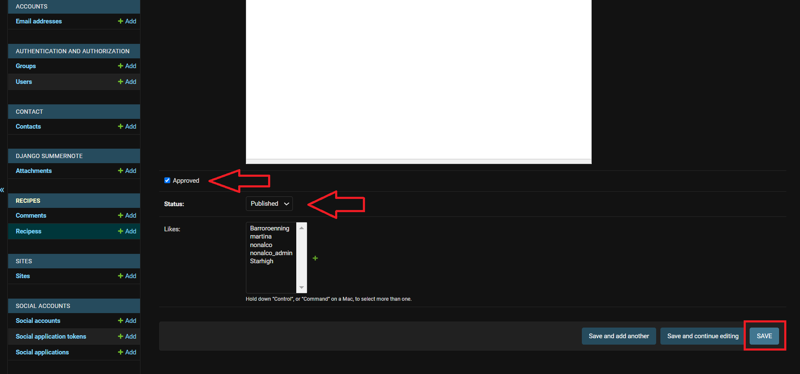
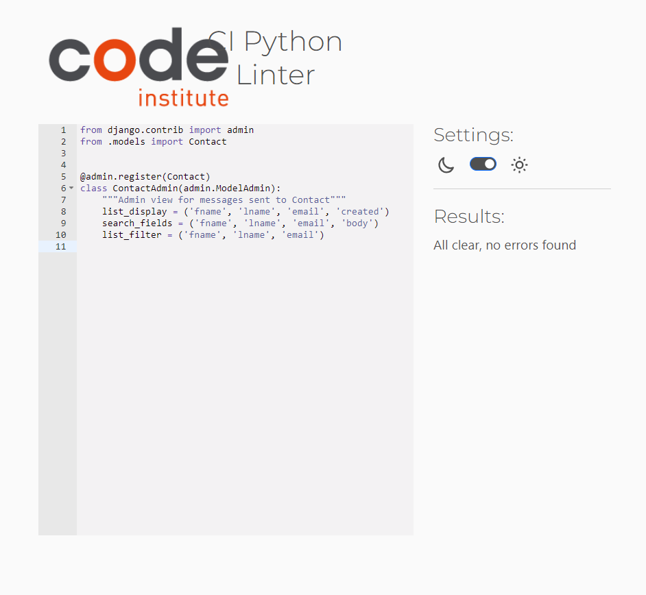
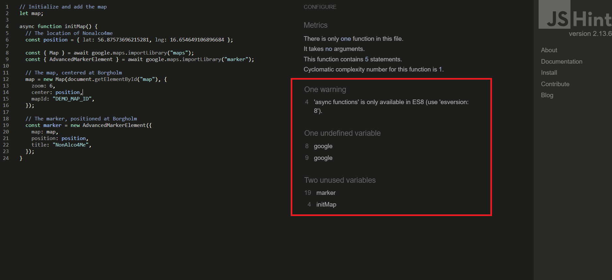
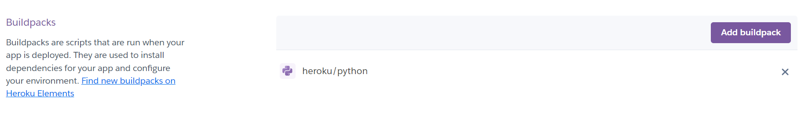

# NonAlco4Me

NonAlco4Me is a website that you can find many different non-alcoholic drink recipes. There are lots of different flavors and combinations. Maybe you want something fruity and sweet or why not a good lemon and tonic.

You can comment on recipes if you want to give feedback to the creator or if you simply want to add something to the recipe to help others bring out a little touch of different flavor in the drink. You can like recipes aswell but also add your own recipes if you are registered on the website.

NonAlco4Me has been built using the Django Framework in Python, HTML and CSS. It provides user authentication and full CRUD functionality.

Please view the live website here: [NonAlco4Me](https://non-alco-4me-427be0bd27b2.herokuapp.com/ "NonAlco4Me Homepage").

## Table of contents
+ [UX](#ux)
  + [Site Purpose](#site-purpose)
  + [Site Goal](#site-goal)
  * [Future Goals](#future-goals)
* [User Stories](#user-stories)
  * [Site User](#as-a-site-user)
  * [Admin](#as-a-admin)
* [Design](#design)
  * [Wireframes](#wireframes)
  * [Color Scheme](#color-scheme)
  * [Typeography](#typography)
  * [Imagery](#imagery)
* [Features](#features)
  * [Homepage](#homepage)
  * [Add Recipes](#add-recipes)
  * [Recipes Home](#recipes-home)
  * [Recipes Detail](#recipes-detail)
  * [Edit ecipes](#edit-recipes)
  * [Delete ecipes](#delete-recipes)
  * [Contact](#contact-page)
  * [Sign-In](#sign-in)
  * [Sign-Out](#sign-out)
  * [Sign-Up](#sign-up)
* [C.R.U.D.](#crud)
  * [Create](#create)
  * [Read](#read)
  * [Update](#update)
  * [Delete](#delete)
* [Manual Testing](#manual-testing)
* [Admin Panel](#admin-panel)
* [Validator Testing](#validator-testing)
* [Defensive Validation](#defensive-validation)
* [Accessibility](#accessibility)
* [Fixed bugs](#fixed-bugs)
* [Technologies Used](#technologies-used)
* [Deployment](#deployment)
* [Credits](#credits)

## UX
### Site Purpose

The purpose of this page is that it should always be the user's first choice to turn to when they want a non-alcoholic drink. That you can get the feeling that you can mix a very good alcohol-free drink even though you will not drink alcohol.

There should be lots of different options with flavors that suit you

### Site Goal

- To provide the user with a platform to find a good nonalco drink recipes which suits the user's taste.
- To provide the user to get an impression that the page is easy to understand and nothing that distracts the eye.
- To providing permissions to allow users to create, update and delete their own recipes. The administrator can approve, manage and delete content, comments and users.

### Future Goals

- The user should have the option of having their own account page where they can save their favorite recipes from the website in a kind of "recipe book".
- Being able to search by flavor in a search box.
- Delete and edit their own comments.

## User Stories

### As a site user: 
- As a site user I can click on recipes so that I can read comments and how to make the drink.
- As a site user I can add my own recipes to the site so that others can use them.
- As a site user I can delete my own recipes on the site so that if I don't want to share it anymore.
- As a site user I can edit my own recipes so that if I forgott something.
- As a site user I can post comments on recepies so that other user can read them.
- As a site user I can like recipes so that other users can know the recipes is good.
- As a site user I can unlike my own like so that I can remove my like if I change my mind.
- As a site user I can send an email to the site so that if I have questions.

### As a Admin:
- As a site owner I can accept comments before it published in admin panel so that there do not write any inappropriate comments.
- As a site owner I can accept recipes before it published in admin panel so that there do not write any inappropriate recipes.
- As a site owner I can view messages submitted via the contact form so that I can communicate with site users.
- As a site owner I can remove users so that they will no longer be able to post unsuitable content.
- As a site owner I can add recipes from the admin panel so that if users do not add any recipes.

## Agile Methodology

The development of this project was managed and implemented using GitHub Projects Kanban Board. Available here:
<a href="https://github.com/users/Karroroenning/projects/6" target="_blank" rel="noopener" aria-label="Link to GitHub Projects">NonAlco4Me - User Stories</a>

 

## Design
### Wireframes

- A low-fi wireframe was build before developing the website.
- This was done in Balsamiq Wireframes. 

Home Page

Create Recipes

Recipes page

Recipes Details

Contact

Signup

Login

Logout

### Color Scheme

I want the colors to give a calming and modern feeling. I have chosen to have a light background so that there will be a good contrast between the important thing that should be seen the most and the background. It must not flow together because it can be perceived as disturbing to the eye. 

### Typography:

All fonts were obtained from the Google Fonts library. I have chosen the same font throughout the web page. A simple typeface that does very well with the rest.

Font: Lato

### Imagery:

- For the first page, I want an image that shows what the page has to offer. The color in the picture is very appropriate with the colors I have on the rest of the website.

Hero Image

 

- For the placeholder image (if a user does not upload their own image when submitting a recipes). I chose this image because it matches the hero image. Although there is a different drink in the picture. You want everything to fit together.

Placeholder image

 
- All other images present on the site will be chosen by users. The admin can change or remove images that are inappropriate, before approving and publishing reviews to the main site.

## Features
### Homepage
- A navbar with nav-items to navigate to various pages in the website.
- We have the hero image with a short info text in it if you are not logged in and if you are logged in there is a button to press called "Add Recipes here +".
- About section is under hero image, there is some information about the page.
- Footer with social media, adress and email.

### Add Recipes
- You press "add recipe +" on the homepage and you get to the add recipes page.
- A navbar with nav-items to navigate to various pages in the website.
- We have an add recipe form. Enter Title on the recipe, Author for the recipe, a body where you write your recipe and a button where you choose an image you want for the recipe. If you do not select an image, it will be a placeholder image.
- Submit button under the form.
- Footer with social media, adress and email.

### Recipes Sites
- A navbar with nav-items to navigate to various pages in the website.
- Recipes lined up. 3 pieces per row. 9 pieces per side.
- On the recipes there is a line where you can see who has created the recipe.
- Under the recipe you can see how many people have liked the recipe.
- When you click on the recipe, you get to recipe details.
- Footer with social media, adress and email.

### Recipes detail
- A navbar with nav-items to navigate to various pages in the website.
- Under the navbar, we have the title of the recipe, author and when it was created. Picture of the recipe is to the right of the text.
- If you have created the recipe yourself, there are two buttons under the title. One where it says edit and one with delete. You can only see those buttons if you are logged in and have created the recipe yourself.
- A section with the contents of the recipe.
- Like button and how many people have liked. The heart is in a red color if you have liked the recipe. 
- Comments icon showing how many people have commented on the recipe.
- The comments section. On the left, all comments that have been written are displayed.
- On the right you write a comment if you are logged in.
- Footer with social media, adress and email.

### Edit Recipes
- A navbar with nav-items to navigate to various pages in the website.
- Only when you are logged in and have made the recipe.
- We have an edit recipe form. You can change the title, recipe content and image.
- Submit button.
- Footer with social media, adress and email.

### Delete Recipes
- A navbar with nav-items to navigate to various pages in the website.
- Only when you are logged in and have made the recipe.
- When you press the delete button, we get an alert message if you want to delete the recipe. There are two buttons, cancel and delete.
- Footer with social media, adress and email.

### Contact Page
- A navbar with nav-items to navigate to various pages in the website.
- When you are logged in. 
- A contact form. With first name, last name, email and message.
- On the right we have a google map and where the office is located.
- Footer with social media, adress and email.

### Sign-in
- A navbar with nav-items to navigate to various pages in the website.
- A box where it says if you want to log out. 
- A logout button.
- Footer with social media, adress and email.

### Sign-out
- A navbar with nav-items to navigate to various pages in the website.
- A login box where you enter your username and password.
- A login button.
- Footer with social media, adress and email.

### Sign-up
- A navbar with nav-items to navigate to various pages in the website.
- A signup box where you enter your username, email, password and password (again) and a sign up button.
- If you already have a login, there is a link below that you can press.
- Footer with social media, adress and email.

## C.R.U.D.

### Create:

#### Create Recipes and Comments

- Create Recipes

- Create Comments

- Comment Approve

### Read:

#### Read Recipes and Comments

- Read Recipes and Comments

### Update:

#### Edit Recipes

- Edit Recipes

### Delete:

#### Delete Recipes

- Delete Recipes

## Manual Testing

### Not logged in:

### Homepage
I have manually tested every link on the homepage to ensure that it redirects to the appropriate url. 

#### ATTENTION! I forgot to add contact us to the nav bar before doing my manual testing. But I added it after and have done a manual test on it and everything works as it should. So contact us may not be on all my print screens.

- Navbar

#### Navbar

- Home, I come to the homepage again.

- Recipes, I come to the recipes.

- Login, I come to the login.

- Contact us, I come to the contact us page.

- Register, I come to the register

- NonAlco4Me, I come to the homepage again.

#### Hero Image

- Hero Image

- Signup, I come to the register.

- Login, I come to the login.

#### Footer Links

- Footer

- Twitter, It open up a new tab with Twitter.

- Linkedin, It open up a new tab with Linkedin.

- Instagram, It open up a new tab with Instagram.

- Facebook, It open up a new tab with Facebook.

- Copyright: NonAlco4Me, I come to the homepage again.

### Recipes page
On the recipes page, we still have our navbar where all links work and a footer that is the same as on the first page. The links you can click on here are on the title that is under the pictures. Then you get to recipes detail and then if there are more than 9 recipes on the page, we have a next button that shows more recipes when you press it.

- Recipes, I come to the recipes.

#### The next side

- The next side button which is at the bottom of the page, I come to the next recipe side. And when I press prev button i come back to the previous recipes page.

#### Recipes Detail

- I press on the title under the recipes image, I come to the recipe details

### Contact us page
On the Contact us page, we still have our navbar where all links work and a footer that is the same as on the first page. On this page I can contact the site owner if I have any questions. I enter all the information and send it to the site owner.

- Contact page there I write my name, email and my content. 

- After I press send I get an alert message that says we will be in touch. 

### Register page
On the register page, we still have our navbar where all links work and a footer that is the same as on the first page. To register, you enter a username and password. Email is not a must. If you were to take a username that already exists, you will get an error message and even if the passwords do not match

- Register page when you write your register info. 

- When the username is already taken or the password do not match. 

- Signup button, if everything is correct. I come to the homepage logged in. 

### Login page
On the login page, we still have our navbar where all links work and a footer that is the same as on the first page. Here you enter your username and password and press login button. If the username and password are correct, you will be taken to the first page with a green alert message saying that you have logged in. If the username and password are not correct, you will receive an error message saying that the username or password is incorrect.

- Login page, if everything is correct, I come to the homepage logged in when i press login button. 

- Login page, if the username or password is incorrect. 

### Logged in:

### Homepage
I have manually tested every link on the homepage to ensure that it redirects to the appropriate url.

- Navbar

#### Navbar

- Home, I come to the homepage again.

- Recipes, I come to the recipes.

- Logout, I come to the logout.

- Contact, I come to the contact

- NonAlco4Me, I come to the homepage again.

#### Hero Image

- Add recipes +, I come to the add recipes.

#### Footer Links

- Footer

- Twitter, It open up a new tab with Twitter.

- Twitter, It open up a new tab with Twitter.

- Linkedin, It open up a new tab with Linkedin.

- Instagram, It open up a new tab with Instagram.

- Facebook, It open up a new tab with Facebook.

- Copyright: NonAlco4Me, I come to the homepage again.

### Add Recipes page
On the Add Recipes page page, we still have our navbar where all links work and a footer that is the same as on the first page. Here I write a title, chose author, write my recipes text and chose a recipe cover image if I want to. If I not chose an image it will give the recipes a placeholder image. Then I press the submit button and I will come to the recipes page with an alert message that the recipes is awaiting approval.

- I press "Add recipes +" button on the homepage, I come to the add recipes.

- Create my recipes page

### Recipes page
On the recipes page, we still have our navbar where all links work and the footer that is the same as on the homepage. The links you can click on here are on the title that is under the pictures and then if there are more than 9 recipes on the page, we have a next button that shows more recipes when you press it.

#### The next side

- When I press the next side button which is at the bottom of the page, I come to the next recipe side. And when I press prev button I come back to the previous recipes page.

#### When my recipes is approved

- When my recipe is approved by admin, the recipe ends up on the first page.

### Recipes Detail
On the recipes detail page, we still have our navbar where all links work and the footer that is the same as on the homepage. 

#### Not my own recipes
Here I can like the recipe and write a comment. When I have written a comment, I press submit and the comment is sent to the admin for approval before it is published. To like the recipe, I press the heart which turns red when you have liked it.

- When I press on the title under the recipes image, I come to the recipe details

- When my comment is approved by admin, the comment ends up under the recipe.

#### My own recipes
Here I can like the recipe and write a comment. When I have written a comment, I press submit and the comment is sent to the admin for approval before it is published. To like the recipe, I press the heart which turns red when you have liked it. Now that it is my own recipe, two buttons have been added, Edit and Delete. When I press the Edit button, I get to the Edit page where I can update my recipe.
When I press the delete button, I get an alert message asking me if I really want to read my recipe.

- When I press on the title under the recipes image on my own recipe I created, I come to the recipe details.

- When my comment is approved by admin, the comment ends up under the recipe.

- I press on the Edit button, I come to the Edit page. I change what is needed and press submit, then I am sent to the Recipes page and an alert message has appeared saying that the recipe has been updated. 

- When I press the delete button, I get an alert message asking if I really want to delete my recipes. When you press delete, you get to the recipe page with an alert message saying that the recipe has been deleted.

### Contact us page
On the contact us page, we still have our navbar where all links work and the footer that is the same as on the homepage. Here we have a contact form and a google map. On googlemaps, I press the plus and minus buttons and everything works as it should. To get in touch with the owner of the website, I write in all the fields and press send. Then I get an alert message that it has been sent. If I only wanted a name in the mail field, I get an error message that it must contain an @.

- Write in the contact form and send a message.

### Logout page
On the logout page, we still have our navbar where all links work and the footer that is the same as on the homepage. When we press logout, we jump to the homepage and there we see an alert message that we are logged out

- When we press logout, we jump to the Homepage.

## Admin panel

- When we login to admin panel we come to the admin page.

### Approve comments
As a site admin I can approve comments so that suitability of content can be ensured. 

- Comments can be selected and then approval can be performed via the dropdown menu:

### Approve Recipes
As a site admin I can approve recipes so that suitability of content can be ensured.

- Reviews can be selected, and then approved and published:

### Add Recipes

-As a site admin I can create recipes to share with other users.

### Contact
As a site admin I can view messages submitted via the contact form so that I can communicate with site users.

- Within the admin panel, the admin can select Contacts:

- Here, the admin can click into messages to read them:

### Remove users
As a site admin I can remove users so that they will no longer be able to post unsuitable content.

- Here, the admin can select users to delete:

### Browsers
- I checked the site for compatibility on different browsers.
- I have checked the responsiveness on different window sizes.

## Validator Testing
#### HTML files pass through the W3C validator with no issues found.

- Add recipes

- Contact Us

- Edit

- Home

- Login

- Logout

- Recipes

- Recipes detail

- Register

#### CSS files pass through the Jigsaw validator with no issues found.

- CSS

#### Python files have been through the validator and have no issues.

- contact_admin

- contact_admin

- contact_forms

- contact_models

- contact_urls

- contact_views

- home_apps

- home_urls

- home_views

- nonalco4me_urls

- nonalco4me_wsg

- nonalco4me_wsgi

- recipes_forms

- recipes_models

- recipes_urls

- recipes_views

#### Javascript file have been through the validator and have no issues.

- maps.js

## Defensive Validation

- When I am not logged in and try to access a page in logged in mode.

If a non-logged-in guest tries to access the add recipes, edit page, delete page, and contact page, they are prompted to log in. If at login they are identified as a logged in user, they are taken to the pages. Otherwise they are taken to the page screenshot above.

## Accessibility

- Lighthouse

## Fixed bugs
- When I was clicking on a recipe to see details, I got an error that my recipes_detail.html does not exist. 
- - 

I was missing the L in HTML.

    
    

 

- I was trying to fix my comments. But when I was running a makemigration, I got (You are trying to add a non-nullable field 'email') I got different all the time. I also tried received 'name'. I couldn't have fixed it without Joshua's help on tutor support. Because I needed to restore my database.

- I had a url path that didn't work when I pressed the add recipes button. So I got an error message. But it turned out that I had placed my url paths in the wrong order.
- - 

- The button that didn't work.

    
    

- - 

- Url path when it didn't work.

    
    

- - 

- The Url path after, then the button worked.

    
    

 

- In my recipe detail, I wanted an edit and delete buttons. But I never got the buttons to appear. But that was because I had creator in my html file and author in my models.py.
- - 

- The button that didn't work.

    
    

- - 

- Url path when it didn't work.

    
    

 

- I didn't get my google maps to show up after I deployed to heroku. But my very kind classmate Starhigh helped me solve the problem. I would just add the secret key as a variable in configvars.

## Technologies Used
### Main Languages Used
- HTML5
- CSS3
- Python
- Javascript
- Django
- SQL - Postgres

### Frameworks, Libraries & Programs Used
- Google Fonts - for the font families:
- Font Awesome - to add icons to the social links in the footer element.
- GitHub - to store my repository for submission.
- Balsamiq - were used to create mockups of the project prior to starting.
- Am I Responsive? - to ensure the project looked good across all devices.
- Favicon - to provide the code & image for the icon in the tab bar.
- Django
- Bootstrap

### Modules used for the development of this project:

- Requirements.

    
    

## Deployment

### Creating Database using ElephantSQL

1. To generate a managed PostgreSQL database, please proceed to [ElephantSQL](https://customer.elephantsql.com/) and either sign up or sign in to your account. Once you've logged in, click on the 'Create New Instance' button.
- - 

See Image

    
    

2. Name your database and select the 'Tiny Turtle' payment plan. Then, click on 'Select Region'

3. Select your preferred region and create the database instance.

4.  After creating the instance, navigate to the instances page and click on the name of the database you selected earlier. Then, in the details section on the following page, copy the PostgreSQL URL.

- - 

See Image

    
    

### Deploying the website in Heroko

#### Before deploying in Heroku following files were created:

1. env.py : stores confidential data eg. API keys, passwords etc.
- - 

See Image

    
    

2. Procfile : Very important for deployment and must be added with capital P
- - 

See Image

    
    

3. Requirements.txt: This must be updated for deployment in Heroku. It stores data of libraries used for project
- - 

See Image

    
    

- The website was deployed to Heroko using following steps:

#### Login or create an account at Heroku

- Make an account in Heroko and login

#### Creating an app

- Create new app in the top right of the screen and add an app name.
- Select region
- Then click "create app".

Create App

#### Open settings Tab

##### Click on config var

- Store CLOUDINARY_URL file from in key and add the values
- Store DATABASE_URL file from in key and add the values
- Store SECRET_KEY file from in key and add the values
- Store PORT in key and value

NOTE: For initial deployment DISABLE_COLLECTSTATIC was also added

Config var

##### Add Buildpacks

- Add python buildpack

Buildpacks

#### Open Deploy Tab

##### Choose deployment method and Connect to Github

- Connect GITHUB
- Login if prompted
- Choose repositories you want to connect
- Click "Connect"

Deployment method

##### Automatic and Manual deploy

- Choose a method to deploy
- After Deploy is clicked it will install various file

 Deploy methods

##### Final Deployment

- A view button will display
- Once clicked the website will open

    
 Deploy

    

The live link for "NonAlco4Me" can be found [HERE](https://non-alco-4me-427be0bd27b2.herokuapp.com/)

## Credits

### Content
- I have received very good help from Think Therefore I Blog from code institute which got me started on my project.
- Checked out [Django Blog Webinar](https://youtu.be/YH--VobIA8c) which helped me understand more about edit and delete buttons.
- Big shoutout to my classmate [Starhigh](https://github.com/gStarhigh) who sat for 4 hours trying to help me get my commenting feature up and running. Unfortunately I needed to restore my database. Which we didn't think of.
- A thank you to Joshua from tutor support who helped me reset my database. When I couldn't makemigrate.
- Code Institute (especially the Django blog) which helped me to understand how it all comes together.
- Rebecca from tutor support helped me to understand my urls path and why it didn't worked.
- Thanks to my mentor Martina for taking the time and giving me good inputs about my project. And sent very good suggestions for different repos that I could get inspiration from.
- I struggled a lot with my google maps, but couldn't get it to work the way I wanted. So I searched on google and found a great youtube video that helped me. [How to add a map to your website with JavaScript](https://www.youtube.com/watch?v=B4p3A00uXAs&t=53s)
- Have looked at [The paper lounge](https://github.com/cornishcoder1/the_paper_lounge) functions and received a lot of inspiration and a lot of understanding of how everything is connected.
- I had a hard time getting started with my readme. So I've looked at three fantastic readme's that I've copied a bit from.
- - [Humanitas](https://github.com/Sinha5714/humanitas_django_pp4/blob/main/README.md)
- - [Hillbox](https://github.com/736B796E6574/CI-PP4/blob/main/README.md)
- - [The paper lounge](https://github.com/cornishcoder1/the_paper_lounge/blob/main/README.md)

## Images

- The images on the homepage including recipes images are taken from [pexels.com](https://www.pexels.com/)