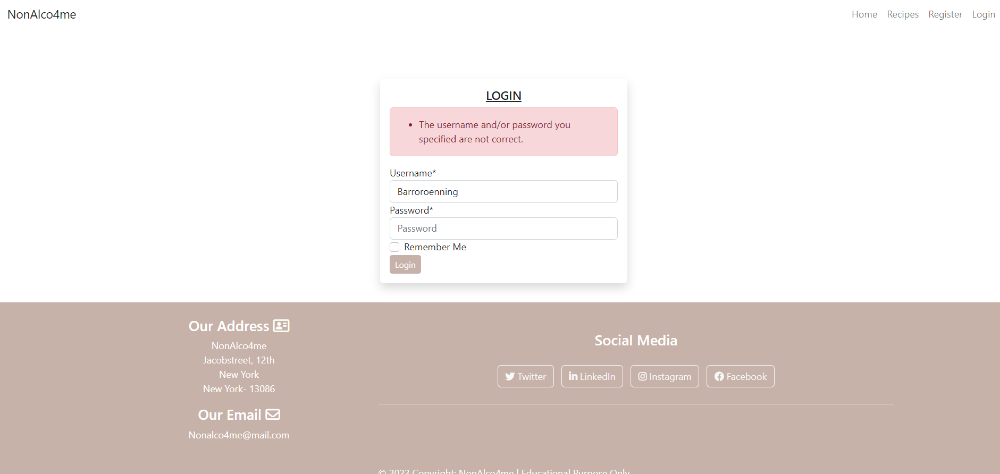

# NonAlco4Me

NonAlco4Me is a website that you can find many different non-alcoholic drink recipes. There are lots of different flavors and combinations. Maybe you want something fruity and sweet or why not a good lemon and tonic.

You can comment on recipes if you want to give feedback to the creator or if you simply want to add something to the recipe to help others bring out a little touch of different flavor in the drink. You can like recipes aswell but also add your own recipes if you are registered on the website.

NonAlco4Me has been built using the Django Framework in Python, HTML and CSS. It provides user authentication and full CRUD functionality.

(Am I Responsive image)

Please view the live website here: [NonAlco4Me](https://non-alco-4me-427be0bd27b2.herokuapp.com/ "NonAlco4Me Homepage").

## Table of contents
+ [UX](#ux)
  + [Site Purpose](#site-purpose)
  + [Site Goal](#site-goal)
  * [Future Goals](#future-goals)
* [User Stories](#user-stories)
  * [Site User](#as-a-site-user)
  * [Admin](#as-a-admin)
* [Design](#design)
  * [Wireframes](#wireframes)
  * [Site Navigation](#site-navigation)
  * [Database Schema](#database-schema)
  * [Color Scheme](#color-scheme)
  * [Typeography](#typography)
  * [Imagery](#imagery)
* [Features](#features)
  * [Homepage](#homepage)
  * [Add Recipes](#add-recipes)
  * [Recipes Home](#recipes-home)
  * [Recipes Detail](#recipes-detail)
  * [Edit ecipes](#edit-recipes)
  * [Delete ecipes](#delete-recipes)
  * [Contact](#contact-page)
  * [Sign-In](#sign-in)
  * [Sign-Out](#sign-out)
  * [Sign-Up](#sign-up)
* [C.R.U.D.](#crud)
  * [Create](#create)
  * [Read](#read)
  * [Update](#update)
  * [Delete](#delete)
* [Future Features](#future-features)
* [Manual Testing](#manual-testing)
* [Automated Testing](#automated-testing)
* [Validator Testing](#fixed-bugs)
* [Accessibility](#accessibility)
* [Technologies Used](#technologies-used)
* [Deployment](#deployment)
* [Credits](#credits)

## UX
### Site Purpose

The purpose of this page is that it should always be the user's first choice to turn to when they want a non-alcoholic drink. That you can get the feeling that you can mix a very good alcohol-free drink even though you will not drink alcohol.

There should be lots of different options with flavors that suit you

### Site Goal

- To provide the user with a platform to find a good nonalco drink recipes which suits the user's taste.
- To provide the user to get an impression that the page is easy to understand and nothing that distracts the eye.
- To providing permissions to allow users to create, update and delete their own recipes. The administrator can approve, manage and delete content, comments and users.

### Future Goals

- The user should have the option of having their own account page where they can save their favorite recipes from the website in a kind of "recipe book".
- Being able to search by flavor in a search box.
- Delete and edit their own comments.

## User Stories

### As a site user: 
- As a site user I can click on recipes so that I can read comments and how to make the drink.
- As a site user I can add my own recipes to the site so that others can use them.
- As a site user I can delete my own recipes on the site so that if I don't want to share it anymore.
- As a site user I can edit my own recipes so that if I forgott something.
- As a site user I can post comments on recepies so that other user can read them.
- As a site user I can like recipes so that other users can know the recipes is good.
- As a site user I can unlike my own like so that I can remove my like if I change my mind.
- As a site user I can send an email to the site so that if I have questions.

### As a Admin:
- As a site owner I can accept comments before it published in admin panel so that there do not write any inappropriate comments.
- As a site owner I can accept recipes before it published in admin panel so that there do not write any inappropriate recipes.
- As a site owner I can view messages submitted via the contact form so that I can communicate with site users.
- As a site owner I can remove users so that they will no longer be able to post unsuitable content.
- As a site owner I can add recipes from the admin panel so that if users do not add any recipes.

## Design
### Wireframes

- A low-fi wireframe was build before developing the website.
- This was done in Balsamiq Wireframes. 

Home Page

Create Recipes

Recipes page

Recipes Details

Contact

Signup

Login

Logout

### Site Navigation

### Database Schema

### Color Scheme

I want the colors to give a calming and modern feeling. I have chosen to have a light background so that there will be a good contrast between the important thing that should be seen the most and the background. It must not flow together because it can be perceived as disturbing to the eye. 

### Typography:

All fonts were obtained from the Google Fonts library. I have chosen the same font throughout the web page. A simple typeface that does very well with the rest.

Font: Lato

### Imagery:

- For the first page, I want an image that shows what the page has to offer. The color in the picture is very appropriate with the colors I have on the rest of the website.

Hero Image

 

- For the placeholder image (if a user does not upload their own image when submitting a recipes). I chose this image because it matches the hero image. Although there is a different drink in the picture. You want everything to fit together.

Placeholder image

 
- All other images present on the site will be chosen by users. The admin can change or remove images that are inappropriate, before approving and publishing reviews to the main site.

## Features
### Homepage
- A navbar with nav-items to navigate to various pages in the website.
- We have the hero image with a short info text in it if you are not logged in and if you are logged in there is a button to press called "Add Recipes here +".
- About section is under hero image, there is some information about the page.
- Footer with social media, adress and email.

### Add Recipes
- You press "add recipe +" on the homepage and you get to the add recipes page.
- A navbar with nav-items to navigate to various pages in the website.
- We have an add recipe form. Enter Title on the recipe, Author for the recipe, a body where you write your recipe and a button where you choose an image you want for the recipe. If you do not select an image, it will be a placeholder image.
- Submit button under the form.
- Footer with social media, adress and email.

### Recipes Sites
- A navbar with nav-items to navigate to various pages in the website.
- Recipes lined up. 3 pieces per row. 9 pieces per side.
- On the recipes there is a line where you can see who has created the recipe.
- Under the recipe you can see how many people have liked the recipe.
- When you click on the recipe, you get to recipe details.
- Footer with social media, adress and email.

### Recipes detail
- A navbar with nav-items to navigate to various pages in the website.
- Under the navbar, we have the title of the recipe, author and when it was created. Picture of the recipe is to the right of the text.
- If you have created the recipe yourself, there are two buttons under the title. One where it says edit and one with delete. You can only see those buttons if you are logged in and have created the recipe yourself.
- A section with the contents of the recipe.
- Like button and how many people have liked. The heart is in a red color if you have liked the recipe. 
- Comments icon showing how many people have commented on the recipe.
- The comments section. On the left, all comments that have been written are displayed.
- On the right you write a comment if you are logged in.
- Footer with social media, adress and email.

### Edit Recipes
- A navbar with nav-items to navigate to various pages in the website.
- Only when you are logged in and have made the recipe.
- We have an edit recipe form. You can change the title, recipe content and image.
- Submit button.
- Footer with social media, adress and email.

### Delete Recipes
- A navbar with nav-items to navigate to various pages in the website.
- Only when you are logged in and have made the recipe.
- When you press the delete button, we get an alert message if you want to delete the recipe. There are two buttons, cancel and delete.
- Footer with social media, adress and email.

### Contact Page
- A navbar with nav-items to navigate to various pages in the website.
- When you are logged in. 
- A contact form. With first name, last name, email and message.
- On the right we have a google map and where the office is located.
- Footer with social media, adress and email.

### Sign-in
- A navbar with nav-items to navigate to various pages in the website.
- A box where it says if you want to log out. 
- A logout button.
- Footer with social media, adress and email.

### Sign-out
- A navbar with nav-items to navigate to various pages in the website.
- A login box where you enter your username and password.
- A login button.
- Footer with social media, adress and email.

### Sign-up
- A navbar with nav-items to navigate to various pages in the website.
- A signup box where you enter your username, email, password and password (again) and a sign up button.
- If you already have a login, there is a link below that you can press.
- Footer with social media, adress and email.

## C.R.U.D.

### Create:

#### Create Recipes and Comments

- Create Recipes

- Create Comments

- Comment Approve

### Read:

#### Read Recipes and Comments

- Read Recipes and Comments

### Update:

#### Edit Recipes

- Edit Recipes

### Delete:

#### Delete Recipes

- Delete Recipes

## Manual Testing

### Not logged in:

### Homepage
I have manually tested every link on the homepage to ensure that it redirects to the appropriate url.

- Navbar

#### Navbar

- Home, I come to the homepage again.

- Recipes, I come to the recipes.

- Login, I come to the login.

- Register, I come to the register

- NonAlco4Me, I come to the homepage again.

#### Hero Image

- Hero Image

- Signup, I come to the register.

- Login, I come to the login.

#### Footer Links

- Footer

- Twitter, It open up a new tab with Twitter.

- Linkedin, It open up a new tab with Linkedin.

- Instagram, It open up a new tab with Instagram.

- Facebook, It open up a new tab with Facebook.

- Copyright: NonAlco4Me, I come to the homepage again.

### Recipes page
On the recipes page, we still have our navbar where all links work and a footer that is the same as on the first page. The links you can click on here are on the title that is under the pictures. Then you get to recipes detail and then if there are more than 9 recipes on the page, we have a next button that shows more recipes when you press it.

- Recipes, I come to the recipes.

#### The next side

- The next side button which is at the bottom of the page, I come to the next recipe side. And when I press prev button i come back to the first recipes page.

#### Recipes Detail

- Title under the recipes image, I come to the recipe details

### Register page
On the register page, we still have our navbar where all links work and a footer that is the same as on the first page. To register, you enter a username and password. Email is not a must. If you were to take a username that already exists, you will get an error message and even if the passwords do not match

- Register page when you write your register info. 

- When the username is already taken or the password do not match. 

- Signup button, if everything is correct. I come to the homepage logged in. 

### Login page
On the login page, we still have our navbar where all links work and a footer that is the same as on the first page. Here you enter your username and password and press login button. If the username and password are correct, you will be taken to the first page with a green alert message saying that you have logged in. If the username and password are not correct, you will receive an error message saying that the username or password is incorrect.

- Login page, if everything is correct, I come to the homepage logged in when i press login button. 

- Login page, if the username or password is incorrect. 

### Logged in:

### Homepage
I have manually tested every link on the homepage to ensure that it redirects to the appropriate url.

- Navbar

#### Navbar

- Home, I come to the homepage again.

- Recipes, I come to the recipes.

- Logout, I come to the logout.

- Contact, I come to the contact

- NonAlco4Me, I come to the homepage again.

#### Hero Image

- Add recipes +, I come to the add recipes.

#### Footer Links

- Footer

- Twitter, It open up a new tab with Twitter.

- Twitter, It open up a new tab with Twitter.

- Linkedin, It open up a new tab with Linkedin.

- Instagram, It open up a new tab with Instagram.

- Facebook, It open up a new tab with Facebook.

- Copyright: NonAlco4Me, I come to the homepage again.

### Add Recipes page

- Add recipes + button on the homepage, I come to the add recipes.

- 

### Recipes page
On the recipes page, we still have our navbar where all links work and a footer that is the same as on the first page. The links you can click on here are on the title that is under the pictures. Then you get to recipes detail and then if there are more than 9 recipes on the page, we have a next button that shows more recipes when you press it.

#### The next side

- The next side button which is at the bottom of the page, I come to the next recipe side.

#### Recipes Detail

- Title under the recipes image, I come to the recipe details

### Browsers
- I checked the site for compatibility on different browsers.
- I have checked the responsiveness on different window sizes.

## Validator Testing
- HTML files pass through the W3C validator with no issues found.
- CSS files pass through the Jigsaw validator with no issues found.
- Python files have been through the validator and have no issues.

## Fixed bugs

## Accessibility

## Technologies Used
### Main Languages Used
- HTML5
- CSS3
- Python
- Javascript
- Django
- SQL - Postgres

### Frameworks, Libraries & Programs Used
- Google Fonts - for the font families:
- Font Awesome - to add icons to the social links in the footer element.
- GitHub - to store my repository for submission.
- Balsamiq - were used to create mockups of the project prior to starting.
- Am I Responsive? - to ensure the project looked good across all devices.
- Favicon - to provide the code & image for the icon in the tab bar.
- Django
- Bootstrap
- DrawSQL

### Installed Packages:
- 'django<4' gunicorn
- dj_database_url psycopg2
- dj3-cloudinary-storage
- django-summernote (link)
- django-allauth (link)
- django-crispy-forms(link)

## Deployment
The site was deployed to Heroku. The steps to deploy are as follows:

- Install Django & Gunicorn: pip3 install 'django<4' gunicorn
- Install Django database & psycopg: pip3 install dj_database_url psycopg2
- Install Cloudinary: pip3 install dj3-cloudinary-storage
- Creating the requirements.txt file with the following command: pip3 freeze --local > requirements.txt
- A django project was created using: django-admin startproject printstatements 
- The Hillbox app was then created with: python3 manage.py startapp blog
- Which was then added to the settings.py file within our project directory
- The changes were then migrated using: python3 manage.py migrate.
- Navigated to Heroku & created a new app called print-statements.
- Added the Heroku Postgres database to the Resources tab.
- Navigated to the Settings Tab, to add the following key/value pairs to the configvars:
key: SECRET_KEY | value: randomkey
key: PORT | value: 8000
key: CLOUDINARY_URL | value: API environment variable
key: DATABASE_URL | value: value supplied by Heroku
- Added the DATABASE_URL, SECRET_KEY & CLOUDINARY_URL to the env.py file 
- Added the DATABASE_URL, SECRET_KEY & CLOUDINARY_URL to the settings.py file
- Add an import os statement for the env.py file.
- Added Heroku to the ALLOWED_HOSTS in settings.py
- Created the Procfile
- Pushed the project to Github
- Connected my github account to Heroku through the Deploy tab
- Connected my github project repository, and then clicked on the "Deploy" button

The live link for "NonAlco4Me" can be found [HERE](https://non-alco-4me-427be0bd27b2.herokuapp.com/)

## Credits
### Content

## Images
